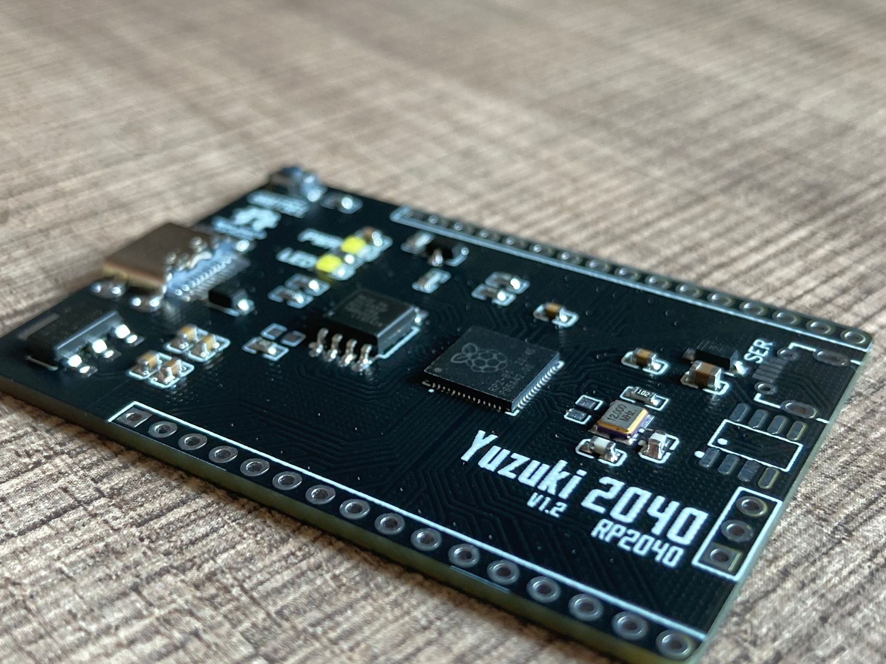

# Yuzuki2040
A dev board based on Raspberry RP2040 MCU

* 双核 Arm Cortex-M0+ @ 133MHz
* 264KB 片内RAM，内部6个独立的RAM块， 在总线中心进行交换，可以让内核和DMA并行运行而无冲突
* 通过专用的QSPI总线可以支持最高16MB的片外Flash存储器
* DMA控制器
* 2 × UARTs, 2 × SPI控制器, 和2 × I2C控制器
* 16 × PWM通道
* 1 × USB 1.1控制器和PHY，支持Host和Device
* 8 × 树莓派可编程I/O状态机
* USB存储启动模式并支持UF2, 可以通过拖拽进行编程
* 芯片售价1美元~~~~

### 更新日志

* 1.2 - 暂未验证
    * 增加CH340N作为板载UART转换芯片，方便MicroPython等开发
    * 增加电源保护反接保护
    * 增加Micro USB接口作为串口输出
* 1.1 - 验证成功
    * 修复3V3与1V1电路绘制错误导致芯片烧毁问题
    * 增加测试脚位
* 1.0 - 验证失败
    * 增加Arduino风格板型
    * 完成电路图绘制
    * 完成PCB绘制

### 成品图片

#### V1.2

#### V1.1

### 官方资料与文档

* [https://www.raspberrypi.org/products/raspberry-pi-pico/](https://www.raspberrypi.org/products/raspberry-pi-pico/)
* [https://www.raspberrypi.org/documentation/rp2040/getting-started/](https://www.raspberrypi.org/documentation/rp2040/getting-started/)
